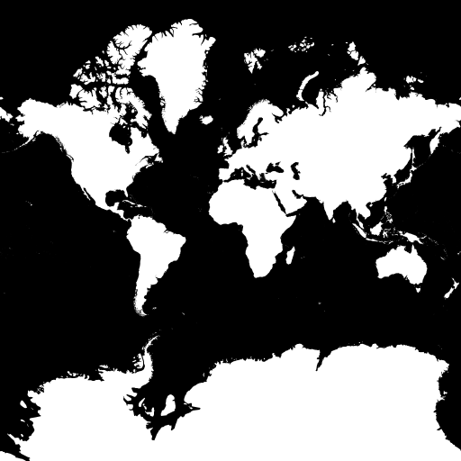

# spatial-dataviz-for-data-scientists
A two day class for introducing concepts and modern tools of geospatial data visualization to data scientists.

These workshops are designed to be very hands-on, with many examples that can be extended as exercises. However, we know it would be impossible to go in-depth with everything that we could find interesting in web mapping! So our goal is to give you a good understanding of the mapping landscape, with some concrete experience with some key mapping tools. The hope is that after going through these examples in class and on your own you will feel empowered to swap in your own data and leverage hundreds of examples in your own data visualization projects!

DO THIS FIRST:

1. Sign up for a free account on CARTO.com
2. Sign up for a free account on github.com (if you don't already have one)

## Day 1
Covers the basics of web mapping, commonly used geospatial data structures for the web, and a range of options for how to create interactive spatial data Visualizations. Day one will leave you in good shape for diving deeper into interactively visualizing spatial data on the web.

### Part 0: Anatomy of a Web Map
Introduction to tiled maps and web friendly geospatial data structures.


### Part 1: Hands on with Leaflet.JS & MapboxGL.JS
[Leaflet.JS](http://leafletjs.com) is a well known javascript library that allows for creating highly customized interactive web maps. We will demonstrate how get up and running with Leaflet by adding a Tile Layer and GeoJSON Layer. We will also take a quick look at MapboxGL and Mapzen's Tangram, tools that allow for utilizing the CPU graphics card to improve performance and expand what's capable with web mapping.

#### Getting your first Leaflet map working with [Blockbuilder.org](http://blockbuilder.org)

- Example 1: Create a bl.ock, load [Leaflet starter](http://blockbuilder.org/almccon/6d632572739217d2804fd2d429b9fa23)

- Example 2: Change tile provider. [Leaflet starter (Toner basemap)](http://bl.ocks.org/almccon/48ad757db4c4be5fee5cf046df0d94bc)

- Example 3: [Leaflet with scale bar and URL hash](http://bl.ocks.org/almccon/0dff3feb062c11c88b8cc150aef60235) using plugins.

- Example 4: [Leaflet starter with GeoJSON overlay](http://bl.ocks.org/almccon/89c3b7da30f8686d3777fdeb65d73250) (tip: use [GeoJSON.io](http://geojson.io) to inspect or create GeoJSON)

- Example 5: [Leaflet with GeoJSON styling and interaction](http://bl.ocks.org/almccon/5ec33135bea51edfe17c32f1331c5182)

Observe the stark difference between the raster _basemap_ and the vector data _overlay_. These two parts of the map are created differently, they behave differently, and the even _look_ different! For a long time this is what all web maps were like. But from here on out we'll see how the boundaries between basemap and overlay are starting to blur:

#### Basemaps (and overlays) in the world of WebGL

- Quick demo of MapboxGL (compare to leaflet w/ same data): Example 6: [MapboxGL vs Leaflet](http://bl.ocks.org/lewis500/4bfd4c87cbb3f17661e6414a910ff89c)

- Tangram is another GL-based renderer. Example 7: [Tangram simple demo](http://bl.ocks.org/almccon/65cdd4aef3f6e5884e8217fcc95efbf2)

### Part 2: Hands on with CARTO Builder & Leaflet
[CARTO](https://carto.com) is a web based platform for analyzing and visualizing spatial data. The new CARTO [Builder](https://carto.com/builder/) platform (being rolled out this month!) is a revamp of their previous Editor and allows users to perform complex spatial analysis, create widgets, and share maps without having to write a line of code. CARTO has a suite of API's which makes it a great "backend" for data visualizations on the web, allowing developers to leverage SQL, PostGIS, and CartoCSS in their web applications. We will give a brief tour of the platform and demonstrate how to incorporate data ("tables") from CARTO into Leaflet.

#### Introduction to CARTO:
- Dashboard overview
- Data vs. Maps views
- [Data Library](https://carto.com/data-library)
- [Data Observatory](https://carto.com/data-observatory/)
- Widgets & Analysis
- Exporting Data
- Integrating the CARTO SQL API with Leaflet
- Creating a Leaflet `tileLayer` from a CARTO table
- Resources for [learning more](https://carto.com/learn/guides)

#### Integrating CARTO with Leaflet
Using [Carto.JS](https://carto.com/docs/carto-engine/carto-js/getting-started/) and the [Carto SQL API](https://carto.com/docs/carto-engine/sql-api/making-calls/) we can load data from a table located in CARTO into a Leaflet map.

- Example 1: [Loading GeoJSON from a Carto Table](http://bl.ocks.org/clhenrick/31196ab4b71d444582b7f8a6535f4c7c)

- Example 2: [Loading a Carto Table as a TileLayer](http://bl.ocks.org/clhenrick/c07d946c3e5f982bc7afadc79b0c5716)

- Example 1 extended: [Advanced GeoJSON usage](http://bl.ocks.org/clhenrick/59513f45bc99bf40ba55de923c490f09)

- Example 2 extended: [Advanced Carto TileLayer usage](http://bl.ocks.org/clhenrick/cd1a348eec8474cb2fca1b503c82f6c1)

### Part 3: Hands on with D3.JS

[D3.js](http://d3js.org) is a client-side javascript visualization and mapping library that differs from Leaflet and CARTO in many fundamental ways. Rather than relying on raster map tiles rendered on a server, D3 draws geometries in the browser using SVG or canvas. In the final section of today's workshop, we'll explore some of the possibilities that D3 opens up.

#### Your first D3 map (GeoJSON in D3)

- Example 1: [D3 map demo](http://bl.ocks.org/almccon/6ab03506d2e3ff9d843f69fa2d5c29cf) 
- Example 1a: [D3 map demo using D3.v4](http://bl.ocks.org/almccon/fe445f1d6b177fd0946800a48aa59c71)

#### TopoJSON
Before we get too far into D3 mapping we need to talk about [TopoJSON](https://github.com/mbostock/topojson), which is an extension of GeoJSON that encodes topology. One of the biggest benefits of this is that file sizes can be significantly smaller.

A couple tools that can be used to orient yourself with TopoJSON files:
- [Inspect TopoJSON](http://blockbuilder.org/enjalot/63d06e2ccadad0cb30dc5f920efd1cdf)
- [Preview TopoJSON](http://blockbuilder.org/enjalot/fe2a8ee0ad59a58ce295f035419d9e63)

- Example 2: [D3 with TopoJSON](http://bl.ocks.org/almccon/410b4eb5cad61402c354afba67a878b8)

You can create TopoJSON using the command line tools, or using a tool like [MapShaper](http://www.mapshaper.org/), which also gives you the ability to _generalize_ your shapes. Generalizing reduces the level of detail in your data, which makes for smaller file sizes, and is often desirable for more elegant and visually pleasing maps.

- Example 3: [Generalizing in MapShaper](http://bl.ocks.org/almccon/0af7228853c736f467cae8a9b906b008)

#### Map projections in D3

[Map projections](https://en.wikipedia.org/wiki/Map_projection) are an important concept, and we need at least a basic grasp
of how they work to make the kinds of [custom maps](https://hi.stamen.com/an-ode-to-d3-js-projections-9d6477d6da0b#.bemxsm2j1) that showcase the power of D3.

One point we need to emphasize is that projections introduce distortion,
to get a sense for how different projections distort the geometry of the earth play with [this example](http://blockbuilder.org/enjalot/bd552e711b8325c64729):

Modify our Example 1 to use one of D3's [many other projections](https://github.com/d3/d3/blob/master/API.md#projections).

- Example 4: [D3 map using Winkel Tripel projection](http://bl.ocks.org/almccon/7cba55415b3bc19e1f383043746756f2)

#### Choosing a projection
Unless you are using a tiled basemap, you should choose an appropriate projection based on the needs of your visualization:
- If you're making a choropleth (we'll talk about these later), use an equal area projection.
- Map of the US, use Albers USA which has built-in sub-projections for Alaska and Hawaii!
- Say, California, use EPSG:3310 California Albers
- Map of the world, consider a Winkel Tripel (although it's not an equal area projection)
- For a city, maybe it doesn't matter if you use Mercator.

Now that we've seen a variety of projections, why do tiled web maps use Mercator? For one thing the whole world fits (almost) perfectly in the square [zoom 0 tile](http://maps.stamen.com/toner/#0/0/0). All other tiles are subdivisions of this one.

[](http://maps.stamen.com/toner/#0/0/0)

#### Projection codes, and how to use them in CARTO and PostGIS
Note: D3 is convenient and it gives all these projections _names_, but if you're using anything other than D3, you might need to know your projection's [EPSG code](http://epsg.io).

A few you might memorize after a while:
  * [EPSG:4326](http://epsg.io/4326) "unprojected" latitude / longitude (a "geographic" projection)
  * [EPSG:3857](http://epsg.io/3857) Web ("Google") Mercator  (old docs will use EPSG:900913)
  * [EPSG:2163](http://epsg.io/2163) [US National Atlas Azimuthal Equal Area](http://bl.ocks.org/mbostock/5050837)
  * [EPSG:3310](http://epsg.io/3310) [California Albers](http://bl.ocks.org/mbostock/5557726)

Finally, we can switch back to CARTO and put these projection codes to work: With [the right PostGIS query](https://mappingmashups.carto.com/viz/2421c766-1305-11e6-a981-0ecd1babdde5/public_map) we are able to use raster tiles in non-Mercator projections! Just don't try to overlay them with any other raster maps!

```
SELECT ST_Transform(the_geom, 2163) AS the_geom_webmercator FROM tablename
```

For more information about projections in CARTO, see [Free Your Maps From Web Mercator](https://carto.com/blog/free-your-maps-web-mercator/)


## Day 2

### Choropleths, Classification, Representation

#### Choropleths, value-by-alpha maps, trivariate classification

Example: [D3 choropleth](http://bl.ocks.org/almccon/a04ce36984ba638202399018445a74a9)
Example: [value-by-alpha choropleth](http://bl.ocks.org/almccon/5842be02ea49e949b016fbebb1d9038a)
Example: [Diverging color schemes](http://bl.ocks.org/almccon/d9de67d6dbc1a6fef95e5d3e79c88501)
Example: [Trivariate choropleth](http://bl.ocks.org/almccon/12bef71ab27b32472e40f74500cb42b7)

#### Classification in D3.js

See [D3 choropleth](http://bl.ocks.org/almccon/a04ce36984ba638202399018445a74a9) above, but try using other options instead of `d3.scaleLinear`

#### Hexbins

Example: [Pop vs soda hexbins in CARTO](https://stamen.carto.com/u/stamen-org/viz/1a89f606-8012-11e4-b9fd-f23c91504230/public_map)
Example: [geocoded social media hexbins in CARTO](https://stamen.carto.com/u/stamen-org/viz/9499c9a6-80cd-11e4-9e9b-f23c91504230/public_map)
Example: [American Panorama hexbins](http://dsl.richmond.edu/panorama/forcedmigration/)
Example: [resizing hexbins on the fly in D3](http://blocks.org/veltman/5994bc0e60cbef5f9390)
Example: [dynamic hexbins in D3](http://bl.ocks.org/syntagmatic/e7dc072643b1a5f121047280093f459e)

### Spatial analysis

#### Spatial queries in PostGIS

How do we view the results of our queries?
  - [CARTO](http://carto.com) is the most fool-proof and interactive method
  - [postgis-preview](https://github.com/NYCPlanning/postgis-preview) is a simple offline viewer with interactive queries, but requires your data to be in [WGS84](https://epsg.io/4326) (lat/lon, EPSG:4326).
  - [QGIS](http://www.qgis.org/) can connect to PostGIS, but you have to save your query results to a new table to view them.
  - [TileMill](https://github.com/tilemill-project) still works, but you have to install it from source.

Some useful PostGIS functions, and real-world examples from Stamen projects:

ST_Distance: (used in the background for the [Blue Greenway map](http://bluegreenway.org))

```
SELECT a.cartodb_id, a.the_geom_webmercator, ST_Distance(a.the_geom_webmercator, b.the_geom_webmercator) as dist FROM sf_parcels_clipped a, bluegreenway_line_snapped b
```

ST_Intersection, ST_Intersects: (see also ST_Contains)

Find all the buildings in the forest (example using an [osm2pgsql OSM database](https://mapzen.com/data/metro-extracts/), and transformed for display using [postgis-preview](https://github.com/NYCPlanning/postgis-preview)):

```
SELECT ST_Transform(a.way,4326) AS geom FROM planet_osm_polygon a, planet_osm_polygon b WHERE a.building='yes' AND b.landuse='forest' AND ST_Intersects(a.way,b.way)
```

Find all the road segemnts that pass through the forest:

```
SELECT ST_Transform(a.way,4326) AS geom FROM planet_osm_roads a, planet_osm_polygon b WHERE a.highway IS NOT NULL AND b.landuse='forest' AND ST_Intersects(a.way,b.way)
```

Find only the _parts_ of those road segments that are in the forest:

```
SELECT ST_Transform(ST_Intersection(a.way,b.way),4326) AS geom FROM planet_osm_roads a, planet_osm_polygon b WHERE a.highway IS NOT NULL AND b.landuse='forest' AND ST_Intersects(a.way,b.way)
```

ST_MakeValid:

```
SELECT cartodb_id, ST_MakeValid(the_geom), bgw_id, name FROM bgw_projects
```

ST_Union:

```
SELECT ST_Union(the_geom_webmercator) as the_geom_webmercator, 'p70' as bgw_zone, 6383 as bgw_id, 'Pier 70' as name, null as pdf_id, 'open space' as category, 1000 as cartodb_id, false as id_is_fake FROM bgw_projects  WHERE name IN ('Pier 70 Upland Open Spaces', 'Pier 70 Slipways Park', 'Pier 70 Crane Cove Park')
```

ST_Centroid:

```
SELECT a.cartodb_id, a.users_shared, a.senate_24_superunit_id, a.senate24total, a.coastal_superunit_id, a.coastaltotal, b.unit_name AS senate_24_superunit_name, c.unit_name AS coastal_superunit_name, ST_MakeLine(ST_Centroid(b.the_geom_webmercator),ST_Centroid(c.the_geom_webmercator)) as the_geom_webmercator FROM "stamen-org".coastal_connections_senate_24 a, harvester_cpad_2015a_superunits b, harvester_cpad_2015a_superunits c WHERE a.senate_24_superunit_id = b.superunit_id AND a.coastal_superunit_id = c.superunit_id
```

ST_MakeLine:

```
UPDATE grants_from_to SET the_geom = ST_SetSRID(ST_MakeLine(ST_MakePoint(fromlng,fromlat),ST_MakePoint(tolng,tolat)), 4326);
```

ST_GeometryFromText, if you want to create simply geometries using [Well-Known Text (WKT)](https://en.wikipedia.org/wiki/Well-known_text) format:

```
create table sf_parks as select * from cpad_units where ST_Intersects(ST_Transform(geom, 4326), ST_GeometryFromText('POLYGON((-123.2 36.7, -123.2 38.7, -121.6 38.7, -121.6 36.7, -123.2 36.7))',4326));
```

ST_SnapToGrid:

```
SELECT ST_Union(ST_SnapToGrid(the_geom,0.0001)) as the_geom, region
```

ST_Difference:

```
SELECT 2 as cartodb_id, ST_Difference(a.the_geom_webmercator, b.the_geom_webmercator) as the_geom_webmercator, 'Tanzania' as name, 0 as dn FROM tza_adm0_simplified a, sagcot b
```

ST_CollectionsExtract, ST_Collect: because sometimes you need to split apart geometries to operate on their individual pieces:

```
insert into regular_delaunay (select 25000 as spacing, ST_CollectionExtract(ST_DelaunayTriangles(ST_Collect(centroid)), 3) geom from hexagons where spacing::text = '25000');
```

CDB_HexagonGrid: (a CartoDB built-in function for making a hexagonal grid). Used for [American Panorama](http://dsl.richmond.edu/panorama/forcedmigration/)

```
create table hexbin_test as select CDB_HexagonGrid(ST_Collect(ST_transform(the_geom, 2163)), 50000, ST_SetSRID(ST_MakePoint(0,0),2163)) as the_geom_webmercator from states
```

ST_SummaryStats (figure out the count, mean, stddev, etc. for intersecting raster cells):

```
update regular_delaunay_dump SET aspect = (SELECT (ST_SummaryStats(ST_Union(ST_Clip(rast, 2, geom_4326, true)))).mean aspect FROM srtm WHERE ST_Intersects(geom_4326, rast)), slope = (SELECT (ST_SummaryStats(ST_Union(ST_Clip(rast, 3, geom_4326, true)))).mean aspect FROM srtm WHERE ST_Intersects(geom_4326, rast)), hillshade = (SELECT (ST_SummaryStats(ST_Union(ST_Clip(rast, 4, geom_4326, true)))).mean aspect FROM srtm WHERE ST_Intersects(geom_4326, rast));
```

ST_GeoHash: (and [why you'd use it](http://www.paulnorman.ca/blog/2016/05/improve-your-st-geohash-sorting-with-these-three-simple-tricks/))

```
CREATE MATERIALIZED VIEW places AS SELECT osm_id, tags -> 'place' AS place, tags -> 'name' AS name, tags -> 'population' AS population, the_geom AS the_geom_webmercator FROM planet WHERE tags -> 'place' IN ('city','town','village','hamlet','suburb','neighbourhood') ORDER BY ST_GeoHash(ST_Transform(ST_SetSRID(Box2D(the_geom), 3857), 4326));
```

Also, some interesting news about Postgres 9.6: [Parallel queries in 9.6](https://www.postgresql.org/about/news/1703/)

#### Spatial analysis in the browser with [turf.js](http://turfjs.org)

Example: [Using turf.js to measure features](http://bl.ocks.org/almccon/a76bb1eb9e3172720c3b9bd090ace725)

Example: [Buffering TopoJSON features using turf.js](http://bl.ocks.org/almccon/4faf79b404b7f775f5a8ce0ee8bb48c0)

Example: [Buffering TopoJSON features using turf.js, drawing with canvas](http://bl.ocks.org/almccon/2f92f27f4a58dab55644205fba6183f2)

### Bigger data in D3

#### Streaming data

One way to stream CSV data is using [PapaParse](http://papaparse.com/)

Example using a different technique: [Streaming Shapefile](http://bl.ocks.org/mbostock/2dd741099154a4da55a7db31fd96a892)

#### Voronois

Example: [World Airports Voronoi](http://bl.ocks.org/Fil/cb80fd5fa34c47a8cace0016aa8ddf2c)

Example: [Using Voronoi as UI](http://bl.ocks.org/emeeks/037488ed37f0e1cbfe32)

#### Drawing to canvas

Example: [Selecting Countries on a Canvas Globe](http://bl.ocks.org/syntagmatic/6645345)

Example: [Canvas Voronoi](http://bl.ocks.org/mbostock/6675193) vs [SVG Voronoi](http://bl.ocks.org/mbostock/4060366)

### Advanced tiled maps

#### React + MapboxGL

#### MapboxGL without using Mapbox's servers

#### Vector tiles

Example: [Using vector tiles in D3](http://bl.ocks.org/mbostock/5593150)

#### Tippecanoe and tile-reduce

- [Tippecanoe](https://github.com/mapbox/tippecanoe)
- [Mapbox QA Tiles](https://www.mapbox.com/blog/osm-qa-tiles/)
- [TileReduce](https://github.com/mapbox/tile-reduce)


